# Development Workflow

```mermaid
flowchart TD
    START([🚀 开始]) --> PRECHECK

    subgraph EDIT["✏️ 编辑阶段"]
        PRECHECK["git status --short\n检查工作区状态"]
        PRECHECK --> CODE["编辑 src/host/*.js\n或 src/client/*.js"]
        CODE --> BUILD["npm run build\n合并 fragments → lib/"]
        BUILD --> TEST["npm test\n单元测试"]
        TEST --> FAIL{通过?}
        FAIL -- ❌ --> CODE
        FAIL -- ✅ --> CHECK["npm run check\n构建产物完整性校验"]
        CHECK --> DIFF["git diff --stat\ngit diff\n审查变更"]
    end

    subgraph DEPLOY["🚀 本地部署（可选）"]
        DIFF --> RUNDEPLOY["npm run deploy\n① build + test\n② 复制 lib/ + cordis.patch.yml\n③ 复制 node_modules/ 依赖\n④ 原子替换 ~/.dsh/profiles/web/node_modules/\n⑤ 旧版备份到 plugin-backups/"]
        RUNDEPLOY --> RESTART["重启 dsh web\n硬刷新浏览器"]
        RESTART --> LOCALOK{本地功能\n验证通过?}
        LOCALOK -- ❌ --> CODE
    end

    subgraph BRANCH["🌿 分支 & PR 阶段"]
        LOCALOK -- ✅ --> NEWBRANCH["git checkout -b feat/<name>\n为本次变更创建功能分支"]
        NEWBRANCH --> GITADD["git add -A"]
        GITADD --> GITCOMMIT["git commit\nConventional Commit 格式"]
        GITCOMMIT --> GETTOKEN["github-auth skill\npython3 get_token.py\n① 有缓存 → 直接返回\n② 无缓存 → Device Flow\n   后台运行，读 stderr\n   展示“Open in browser + 设备码”\n   等用户手动浏览器授权\n   用户确认后再取缓存 token\n   缓存至 /tmp/.pi_github_token"]
        GETTOKEN --> PUSHBRANCH["git push https://TOKEN@github.com/...\npush feature branch"]
        PUSHBRANCH --> CREATEPR["GitHub API: POST /repos/.../pulls\ntitle / head / base=main / body"]
        CREATEPR --> MERGEPR["GitHub API: PUT /repos/.../pulls/:n/merge\nmerge_method: squash"]
        MERGEPR --> PULLMAIN["git checkout main\ngit pull origin main"]
    end

    subgraph PREGH["🧪 发布前 GitHub 源安装测试"]
        PULLMAIN --> CLEANGH["清理 profile slot\n删除 package.json 条目\n删除 node_modules/@washi4\n临时设置 git URL 重写（HTTPS 授权）"]
        CLEANGH --> TESTGH["测试 GitHub 源安装（装 main 源码）\ndsh plugin --profile web add\ngithub:washi4/dsh-llm-github-copilot -w"]
        TESTGH --> VERIFYGH{"验证清单\n• 源码构建 lib/ 成功\n• cordis.patch.yml 存在\n• client.js id 正确\n• undici/deps 可 resolve\n• dump-config 识别插件"}
        VERIFYGH -- ❌ --> FIXGH["直接修复\n回到编辑阶段（未打 tag，无需升版）"]
        FIXGH --> CODE
        VERIFYGH -- ✅ --> CLEANUPGH["清理 git URL 重写\n（移除临时 token 注入）"]
    end

    subgraph RELEASE["🏷️ 发布阶段"]
        CLEANUPGH --> CHANGELOG["更新 CHANGELOG.md\n添加版本条目"]
        CHANGELOG --> COMMITCL["git commit\ndocs: update CHANGELOG for vX.Y.Z"]
        COMMITCL --> NPMVER["npm version patch|minor|major\n① preversion: npm test + git diff\n② 更新 package.json version\n③ version: npm run build && git add lib/\n④ 创建 git commit + tag"]
        NPMVER --> PUSHTAG["git push main\ngit push vX.Y.Z tag"]
    end

    subgraph CI["⚙️ GitHub Actions CI"]
        PUSHTAG --> TRIGGER["Release workflow 触发\n(push v* tag)"]
        TRIGGER --> CISTEPS["① npm ci\n② npm run build\n③ npm test\n④ 校验 package.json version == tag\n⑤ npm publish (OIDC Trusted Publishing)\n⑥ gh release create"]
        CISTEPS --> CIPUB{发布成功?}
        CIPUB -- ❌ --> HOTFIX["修复问题\ntag 未 publish 可移动重推；\n已 publish 则重打 patch tag"]
        HOTFIX --> TRIGGER
    end

    subgraph POSTTEST["🧪 发布后 npm 安装测试"]
        CIPUB -- ✅ --> WAITCI["等待 CI: Release workflow\ncompleted | success"]
        WAITCI --> CLEAN["清理 profile slot\n删除 package.json 条目\n删除 node_modules/@washi4\n新版本加入 minimumReleaseAgeExclude"]
        CLEAN --> TESTNPM["测试 npmjs 安装\ndsh plugin --profile web add\n@washi4/dsh-llm-github-copilot@latest"]
        TESTNPM --> VERIFYNPM{"验证清单\n• version 正确\n• cordis.patch.yml 存在\n• client.js id 正确\n• undici/deps 可 resolve\n• dump-config 识别插件"}
        VERIFYNPM -- ❌ --> HOTFIX
        VERIFYNPM -- ✅ --> DONE
    end

    DONE([✅ 发布完成])

    style EDIT fill:#e8f4fd,stroke:#2196F3
    style DEPLOY fill:#e8f5e9,stroke:#4CAF50
    style BRANCH fill:#fff3e0,stroke:#FF9800
    style PREGH fill:#e0f2f1,stroke:#009688
    style RELEASE fill:#fce4ec,stroke:#E91E63
    style CI fill:#f3e5f5,stroke:#9C27B0
    style POSTTEST fill:#e0f2f1,stroke:#009688
```

## GitHub Device Flow 授权（BRANCH & PR 阶段）

推送分支、创建/合并 PR、推 tag 前需要 GitHub token。采用 `github-auth` skill
的 **Device Flow**，且**必须由用户手动授权**：

1. 后台运行 `python3 ~/.pi/agent/skills/github-auth/scripts/get_token.py`，
   把 stdout/stderr 重定向到临时文件（脚本会阻塞轮询）。
2. 从 stderr 读取并向用户展示：
   - `🌐 Open in browser : https://github.com/login/device`
   - `🔑 Enter code : XXXX-XXXX`（设备码，有效期约 899 秒）
3. **等待用户在浏览器完成授权并确认**，不要自行绕过。
4. 用户确认后再次调用 `get_token.py` 取回已缓存的 token（`gho_…`），
   缓存位于 `/tmp/.pi_github_token`，同一 OS 会话内后续调用直接复用、无需再授权。
5. token 只经环境变量传递给 `git push` / GitHub API，绝不回显或写入日志。

## 安装测试顺序（GitHub 源测试前置）

安装测试拆成两处，**GitHub 源安装测试提前到发布前**：

1. **发布前 GitHub 源安装测试**（BRANCH & PR 合并后、RELEASE 打 tag 前）：
   - 此时 main 已含本次改动但尚未打 tag，`github:` 安装直接拉取 main 源码并
     在 profile 内构建 `lib/`。
   - 若验证失败，**直接回到编辑阶段修复**（尚未打 tag、未升版本、未 publish，
     修复成本最低），修好后重新走 EDIT → DEPLOY → BRANCH & PR。
   - 通过后再进入 RELEASE，避免把已知有问题的构建打成正式 tag/发布。
   - 需要 `-w` 与 `pnpm-workspace.yaml` 的 `allowBuilds`，以及一次性的 git URL
     重写（HTTPS 授权）；测试后立即清理该重写。

2. **发布后 npm 安装测试**（CI publish 成功后）：
   - 只验证 npmjs 发布产物（tarball 已由 CI 构建，无需源码构建）。
   - 新版本刚发布时会被 pnpm 的 `minimumReleaseAge` 供应链策略拦截并回退到旧版；
     需先把新版本加入 profile `pnpm-workspace.yaml` 的 `minimumReleaseAgeExclude`，
     再用 `@latest` 或显式 `@X.Y.Z` 安装。
   - npm 测试失败进入 HOTFIX：tag 未被 publish 时可移动 tag 重推；已 publish 则
     不可复用版本号，必须重打 patch tag。
